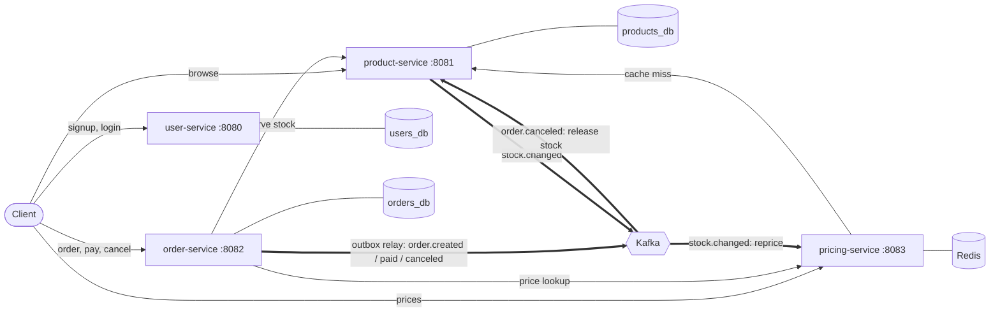
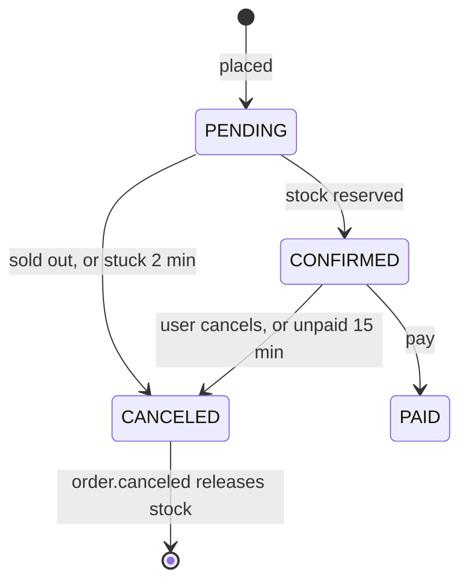

# Flash Sale Backend

Go microservices for an e-commerce flash sale: thousands of buyers hit "buy" at the same second for
a hundred items. The goal is correctness under pressure, not features: **never oversell, never lose
stock, never charge twice**, even with concurrent requests, double clicks, client retries, timeouts and
crashed processes.

Every push runs a load test in CI: 2,000 buyers, each double-clicking, race for 100 units. The build fails
unless exactly 100 are sold, 0 are left, and no request errors.

## Architecture



| Service | Owns | Does |
|---|---|---|
| user-service | `users_db` | Signup (bcrypt), login (JWT) |
| product-service | `products_db` | Catalog and stock; atomic, idempotent reservations; releases stock on `order.canceled` |
| order-service | `orders_db` | Order lifecycle, idempotency keys, transactional outbox, sweeper for stuck and unpaid orders |
| pricing-service | Redis cache | Scarcity pricing (+10% at ≤50 left, +25% at ≤10), updated from `stock.changed` |

Each service has its own database and its own MySQL user, and each is its own Go module with its own image.

## How it stays correct

**1. Stock is checked and taken in one statement.**

```sql
UPDATE products SET stock = stock - ? WHERE id = ? AND stock >= ?
```

With 0 rows updated there is not enough stock. No read-then-write gap, so no race. The row lock queues
buyers, and `CHECK (stock >= 0)` on the column backs it up if the code is ever wrong.

**2. Reservations are idempotent per order.** A `reservations` row keyed by order ID records the outcome.
Retrying a reservation takes stock once, releasing twice gives it back once, and a release that overtakes
its reserve leaves a marker that blocks the late reserve. Multi-item orders lock rows in ID order, so they
can't deadlock each other.

**3. Double clicks create one order.** `POST /orders` takes an `Idempotency-Key` header, enforced by
`UNIQUE (user_id, idempotency_key)`. Concurrent duplicates wait on that index and then get the same order.

**4. Only the server sets prices.** Prices come from pricing-service and are locked into the order;
whatever price the client sends is ignored.

**5. Events can't be lost.** An order's status change and its event are written in the same transaction
(transactional outbox). A relay publishes them to Kafka at least once, using `FOR UPDATE SKIP LOCKED`
so replicas can relay side by side. Consumers are idempotent, so redelivery is harmless.

**6. Failures heal themselves.** If the reserve call times out, the order stays `PENDING` and the client gets
503. Retrying with the same key resumes that order. If no retry comes, a sweeper cancels it after 2 minutes,
and `order.canceled` returns any stock it held.

**7. Nobody can sit on stock.** A confirmed order that isn't paid within 15 minutes is canceled and its stock
goes back on sale, so buyers (or bots) can't hoard a flash sale by reserving without paying.



## Run it

Needs Docker. Config and secrets live in `.env`, which git ignores:

```bash
cp .env.example .env    # then change the values; see the comments inside
docker compose up -d --build
```

```bash
# Sign up and log in
curl -s localhost:8080/users -H 'Content-Type: application/json' \
  -d '{"username":"ana","email":"ana@example.com","password":"correct-horse"}'
TOKEN=$(curl -s localhost:8080/login -H 'Content-Type: application/json' \
  -d '{"email":"ana@example.com","password":"correct-horse"}' | jq -r .token)

# Browse and price
curl -s localhost:8081/products
curl -s localhost:8083/prices/1

# Order (run it twice: same key, same order), then pay
curl -s localhost:8082/orders -H "Authorization: Bearer $TOKEN" -H 'Idempotency-Key: try-1' \
  -H 'Content-Type: application/json' -d '{"items":[{"product_id":1,"quantity":2}]}'
curl -s -X POST localhost:8082/orders/1/pay -H "Authorization: Bearer $TOKEN"
```

Everything listens on localhost only. To watch `order.created` and `stock.changed` arrive as you order, start
Kafka UI (opt-in, since it has no login): `docker compose --profile debug up -d kafka-ui`, then open
<http://localhost:8090>.

### API

| Method | Path | Auth | Notes |
|---|---|---|---|
| POST | `/users` | none | `{username, email, password}` |
| POST | `/login` | none | returns `{token}` |
| GET | `/users/me` | JWT | |
| GET | `/products`, `/products/:id` | none | includes live stock |
| GET | `/prices/:id` | none | `{base_price_cents, price_cents, stock}` |
| POST | `/orders` | JWT | `{items:[{product_id, quantity 1-10}]}`, optional `Idempotency-Key`; 201 confirmed, 409 sold out |
| GET | `/orders/:id` | JWT | own orders only |
| POST | `/orders/:id/pay` | JWT | CONFIRMED to PAID |
| POST | `/orders/:id/cancel` | JWT | PENDING or CONFIRMED to CANCELED |
| POST | `/internal/reservations` | `X-Internal-Token` | service to service only |

Money is integer cents everywhere.

## Prove it

```bash
./scripts/loadtest.sh                      # 2,000 buyers, 100 units
BUYERS=10000 VUS=1000 ./scripts/loadtest.sh
```

k6 fails the run if any response is a server error, if the two clicks of one buyer ever get different
orders, or if the confirmed count isn't exactly the stock. The script then checks MySQL directly: units
sold equal the stock, and 0 are left.

Results on a MacBook Air (Apple Silicon), with the whole stack in Docker Desktop on that one machine.
Every buyer double-clicks and pays if they win:

| Buyers (concurrent) | HTTP requests | Sold | Sold out | Server errors | Throughput | p50 | p95 |
|---|---|---|---|---|---|---|---|
| 2,000 (300) | 4,106 | 100 | 1,900 | 0 | ~1,400 req/s | 298 ms | 629 ms |
| 10,000 (1,000) | 20,106 | 100 | 9,900 | 0 | ~1,300 req/s | 1.13 s | 2.37 s |

Throughput stays flat as concurrency grows: extra buyers wait in line (higher latency) instead of failing.
Where that line forms hasn't been profiled yet. The single hot product row is the main suspect.

Integration tests run against real MySQL. The oversell test fires 300 concurrent reservations at 50 units:

```bash
docker compose up -d mysql
set -a; . ./.env; set +a
(cd product-catalog-service && PRODUCTS_TEST_DSN="product_svc:$PRODUCT_DB_PASSWORD@tcp(localhost:3306)/products_db" go test ./...)
(cd order-service && ORDERS_TEST_DSN="order_svc:$ORDER_DB_PASSWORD@tcp(localhost:3306)/orders_db?parseTime=true" go test ./...)
```

## Design decisions

- **Inventory lives in product-service.** Stock has one owner. Splitting it across services is how you
  oversell.
- **Stock is reserved synchronously when the order is placed.** Taking it later, when an `order.created`
  event arrives, leaves a window where a thousand buyers all pass the stock check. Events handle everything
  downstream instead: stock release, repricing, and future consumers.
- **`stock.changed` is fire-and-forget.** Each event carries the absolute stock level, so the next one
  repairs a lost one. Pricing takes only the stock level from it; base prices always come from
  product-service, and cached prices expire 10s after that fetch. Order events, which must not be lost, go
  through the outbox.
- **One Kafka broker locally**, in KRaft mode. Replication only matters once there are brokers to replicate
  to (see roadmap).
- **No shared Go library.** About 40 lines of `main` boilerplate are copied per service, so each service
  builds, versions and deploys on its own.

## Security

**In place:**
- **Secrets:** they live in `.env` (git-ignored), and services refuse to start with a JWT secret or internal
  token under 32 characters.
- **Passwords:** stored with bcrypt, and never returned by the API.
- **Login:** a failed attempt takes the same time whether or not the email exists. Signup and login are
  limited to 10 attempts a minute per IP.
- **Least privilege:** each service has its own MySQL login that can only read and write its own database,
  with no schema changes and no access to other services' data.
- **Localhost only:** every port is published on 127.0.0.1. Redis requires a password, and Kafka UI is
  opt-in.
- **Orders:** users only see and change their own orders (others' are a 404). Prices are set and
  sanity-checked on the server. One order line holds at most 10 units, and unpaid orders give their stock
  back after 15 minutes.
- **Idempotency keys:** bound to their request, so reusing one for a different cart is refused, and they
  are compared case-sensitively.
- **Stock events:** a forged `stock.changed` event can shift a price between tiers but never set it.
- **HTTP hardening:** 64 KB request bodies, server read/write timeouts, error responses without internals,
  and client IPs taken from the connection, never from `X-Forwarded-For`.
- **Containers:** distroless images running as non-root.
- **CI:** read-only token, actions pinned to commit SHAs, and `govulncheck` on every push.

**Known gaps (for production):**
- Kafka has no authentication, so anything on the internal network could publish `order.canceled` and free
  another order's stock. Production needs SASL with ACLs (MSK IAM).
- One HS256 secret both signs and verifies tokens, so order-service could mint them. Move to asymmetric keys
  (user-service signs, everyone else verifies), require `exp`, check `iss`/`aud`, and add revocation.
- Traffic between services and to MySQL is plain TCP inside the Docker network. Production needs TLS (ALB,
  RDS `tls=true`, mTLS or signed service tokens).
- Signup answers "email already registered", which reveals who has an account (rate-limited, not closed).
  Closing it takes email verification.
- Rate limits are in memory and per replica, and only on auth. Public reads and `/orders` need limits at a
  gateway. Behind a load balancer, the client IP must come from its trusted `X-Forwarded-For`.
- Reservations are keyed by order ID, so `orders_db` and `products_db` must always be restored together. If
  order IDs are ever reused, a new order could inherit an old reservation. Globally unique IDs would remove
  this.

## Roadmap

Local stack, tests and CI are done. Next:

- [ ] Deploy to AWS: images to ECR, ECS Fargate, RDS MySQL, ElastiCache, MSK
- [ ] Secrets Manager for DB passwords, `JWT_SECRET`, `INTERNAL_TOKEN` and `REDIS_PASSWORD`
- [ ] Close the known security gaps above: Kafka SASL/ACLs, asymmetric JWT, TLS everywhere
- [ ] ALB with TLS, with the client IP taken from its trusted `X-Forwarded-For`
- [ ] CloudWatch logs, metrics (order latency, stock levels) and alarms
- [ ] Auto scaling on latency and queue depth; Terraform for all of it
- [ ] Prometheus and Grafana locally, to watch a flash sale live
- [ ] 3-broker Kafka with replication factor 3: kill a broker mid-sale
- [ ] Profile the ~1,300 req/s ceiling; if it's the hot product row, add a Redis stock gate in front of MySQL
- [ ] Per-user purchase limits, gateway rate limiting, bot protection
- [ ] Outbox retention job; singleflight and 404 caching on pricing cache misses
- [ ] Real payments and refunds
